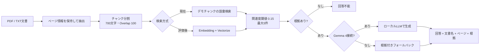

# Local RAG Document Assistant

企業内文書・設備マニュアル・手順書・FAQを検索し、回答と根拠を一緒に確認できるRAGポートフォリオです。

## 発注者向け概要

自然文で質問すると、登録文書から関連箇所を検索し、文書名・ページ・関連度・根拠文章を回答とともに表示します。

- 社内規程や業務手順を確認するFAQ
- 設備マニュアルや点検基準の検索
- 保守担当者向けのトラブルシューティング
- 文書を根拠にした社内ナレッジ検索

根拠が十分でない質問には、推測で補完せず、次の回答を返します。

```text
登録された文書からは確認できません。
```

## Live Demo

<https://local-rag-document-assistant.katamachi.workers.dev>

公開デモはポートフォリオ確認用で、現在は **retrieval fallback** が動作します。実Gemma 4の公開推論が有効になっている状態ではありません。

実Gemma 4へ切り替えるには、OpenAI互換エンドポイント、Cloudflare Tunnel、Cloudflare Access Service Auth、Worker Secretを設定し、`LOCAL_LLM_BASE_URL` と `LOCAL_LLM_MODEL` を設定して再デプロイします。

実Gemma接続時は回答メタ情報に `Gemma 4 / local API`、未接続時は `retrieval fallback` と表示されます。

## RAG処理フロー



現在の公開デモは検索・閾値判定・出典表示・回答不能処理を検証する縦切りです。Vectorizeは日本語Embeddingモデルの評価後に有効化する予定で、現時点では未プロビジョニングです。

## セキュリティと制約

- PDF原本は非公開R2に保存し、アプリのファイルAPI経由で取得します。
- ローカルLLMのポートを直接インターネットへ公開せず、Cloudflare Tunnelを経由します。
- Tunnel接続ではBearer tokenを使用し、Cloudflare Accessを追加できます。
- 回答には検索コンテキストだけを渡し、低スコア結果を除外します。
- 文書内の命令文は引用データとして扱い、システム指示と分離します。
- 公開デモの管理画面は文書一覧とPDF閲覧だけの読み取り専用です。
- 公開デモは機密文書の業務運用を想定していません。実案件では認証・認可、テナント分離、更新管理、監査ログを追加します。

## Cloudflare構成の役割

| コンポーネント | 役割 |
| --- | --- |
| Cloudflare Workers / Next.js | UI、質問API、文書APIを一つの公開URLで提供 |
| Cloudflare R2 | 非公開PDF原本を保存 |
| Cloudflare Tunnel | WorkerからローカルLLMへのアウトバウンド接続 |
| Cloudflare Access | TunnelのService Authによる接続元検証 |
| Gemma 4 / llama-server | 検索根拠を使った回答生成 |
| Vectorize | 日本語Embedding評価後に導入する将来のベクトル検索 |

## 評価用サンプル

| 質問 | 期待する動作 |
| --- | --- |
| 非常用発電機の点検頻度は？ | 点検基準の根拠とページを表示 |
| 火災報知設備に異常が出た場合は？ | 点検手順の確認事項・復旧手順を表示 |
| 空調機から異音が発生した場合は？ | マニュアルの確認項目と保全依頼の根拠を表示 |
| 文書にない製品の価格は？ | 回答不能として推測しない |

## 実装済み / 未実装

### 実装済み

- Next.js UIとCloudflare Workers公開
- PDF/TXTのページ情報を考慮した文書・チャンクモデル
- デモチャンク検索、関連度閾値、最大5件取得
- 回答不能処理、回答本文、出典、根拠文章の表示
- OpenAI互換ローカルLLMアダプター
- Cloudflare Tunnel向け認証プロキシ
- 非公開R2 PDFの一覧・閲覧
- PDFページ送り、拡大縮小、ピンチ操作
- Prompt Injectionを考慮したプロンプト境界

### 未実装・保留

- 日本語Embeddingモデルの比較評価
- Cloudflare Vectorizeの本番インデックス
- D1による文書メタデータ永続化
- OCR、Word/Excel/Google Drive/SharePoint/Slack連携
- Hybrid Search、Reranker、Knowledge Graph
- 本番向けの複雑な権限管理、版管理、再インデックス、監査ログ
- 公開デモでの文書アップロード・削除・再読込

## 案件で応用できること

- 社内規程・就業規則・安全手順の検索
- 設備保全、点検、障害対応マニュアルの検索
- FAQ・ナレッジベースの回答支援
- 外部LLMへ機密文書を送らないオンプレミス / プライベートLLM構成
- 文書更新、権限、監査、評価データを追加した業務システム化

検索・生成・保存・認証を分離しているため、Embeddingモデル、生成モデル、保存先、アクセス制御を案件要件に合わせて交換できます。

## ローカルで動かす

```bash
npm install
cp .env.example .env.local
npm run dev
```

<http://localhost:3000> を開きます。

```text
LOCAL_LLM_BASE_URL=http://127.0.0.1:8080/v1
LOCAL_LLM_MODEL=gemma-4-e4b
LOCAL_LLM_API_KEY=
```

## 品質確認

```bash
npm run typecheck
npm run worker:typecheck
npm test
npm run build
```

## Cloudflareへデプロイする場合

```bash
npm run cf-typegen
npm run deploy
npx wrangler deployments list
```

Tunnel接続を有効にする場合は、秘密情報をGitへ保存せず、Cloudflare Workers Secretまたはローカルの`.env.tunnel`へ設定します。

```bash
npx wrangler secret put LOCAL_LLM_TUNNEL_TOKEN
npx wrangler secret put CF_ACCESS_CLIENT_ID
npx wrangler secret put CF_ACCESS_CLIENT_SECRET
```

`LOCAL_LLM_BASE_URL` に `localhost` を設定したまま公開環境へデプロイしないでください。オプションの認証ブリッジを使う場合は、[docs/tunnel-security.md](docs/tunnel-security.md) と `worker/src/index.ts` を確認してください。

## 関連資料

- [アプリケーション説明書](docs/application-guide.md)
- [システム構成](docs/architecture.md)
- [Tunnelセキュリティ設計](docs/tunnel-security.md)
- [管理画面の設計](docs/maintenance-mode.md)

## Portfolio positioning

> ローカルLLMのGemma 4とRAGを組み合わせ、企業内文書を根拠付きで検索できるWebアプリケーションを設計・構築しました。

業務文書を外部LLM APIへ送信しない構成、検索と生成の分離、出典表示、Cloudflareによる接続境界を主な差別化ポイントとします。
