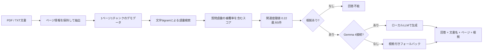

# Local RAG Document Assistant

企業内のバックオフィス文書を検索し、回答と根拠を一緒に確認できるRAGポートフォリオです。

## 発注者向け概要

自然文で質問すると、登録文書から関連箇所を検索し、文書名、ページ、関連度、根拠文章を回答とともに表示します。

公開デモでは、経費精算、備品管理、勤怠及び休暇の3冊を扱います。

- 社内規程や業務手順を確認するFAQ
- 経費申請と証憑保存の確認
- 貸与品の購入、利用、紛失対応の確認
- 労働時間、残業、年次有給休暇、在宅勤務の確認

根拠が十分でない質問には、推測で補完せず、次の回答を返します。

```text
登録された文書からは確認できません。
```

## サンプル文書の位置付け

3冊の文書は架空会社を想定したポートフォリオ用サンプルです。

各ページは、次の区分を明示しています。

- **法令上のルール**：公的資料を基にした一般的な説明
- **架空会社の社内運用例**：金額、期限、承認経路などのデモ用設定
- **個別確認事項**：就業規則、労使協定、契約、事業条件、専門家確認が必要な事項

このサンプルは、税理士、社会保険労務士、弁護士による個別確認を受けた実務規程ではありません。

法令適合を保証するものでもありません。

実際の規程として使用する場合は、最新法令、就業規則、労使協定及び個別の事業条件を確認し、専門家の確認を受けてください。

## 文書構成

| 文書ID | 文書名 | ページ | チャンク |
| --- | --- | ---: | ---: |
| `demo-expense` | 経費精算及び出張旅費規程.pdf | 5 | 5 |
| `demo-assets` | 備品購入及び貸与品管理ガイド.pdf | 5 | 5 |
| `demo-attendance` | 勤怠及び休暇申請ガイド.pdf | 5 | 5 |

合計は15ページ、15チャンクです。

1ページを1検索チャンクとして扱い、単独のページだけでも回答根拠を確認できる文章にしています。

文書本文、固定検索チャンク、一覧メタデータ、PDF生成は、[`fixtures/demo-backoffice-documents.json`](fixtures/demo-backoffice-documents.json)を共通のデータ源として使います。

## Live Demo

<https://local-rag-document-assistant.katamachi.workers.dev>

公開デモはポートフォリオ確認用です。

今回の文書置換はPRで検証した後、R2文書の置換とCloudflareへのデプロイを別工程で行います。

公開反映前のURLには旧データが表示される可能性があります。

現在の公開推論は **retrieval fallback** です。

実Gemma 4の公開推論が有効になっている状態ではありません。

実Gemma 4へ切り替えるには、OpenAI互換エンドポイント、Cloudflare Tunnel、Cloudflare Access Service Auth、Worker Secretを設定し、`LOCAL_LLM_BASE_URL`と`LOCAL_LLM_MODEL`を設定して再デプロイします。

実Gemma接続時は回答メタ情報に`Gemma 4 / local API`、未接続時は`retrieval fallback`と表示されます。

## RAG処理フロー



現在の検索は、長いページ本文でコサイン類似度が過度に下がらないよう、質問側の文字bigram被覆率を加味します。

日本語の機能語だけが一致して誤検索されないよう、一般的な接続表現の一部を除外しています。

Vectorizeは日本語Embeddingモデルの評価後に有効化する予定で、現時点では未プロビジョニングです。

## セキュリティと制約

- PDF原本は非公開R2に保存し、アプリのファイルAPI経由で取得します。
- ローカルLLMのポートを直接インターネットへ公開せず、Cloudflare Tunnelを経由します。
- Tunnel接続ではBearer tokenを使用し、Cloudflare Accessを追加できます。
- 回答には検索コンテキストだけを渡し、低スコア結果を除外します。
- 文書内の命令文は引用データとして扱い、システム指示と分離します。
- 公開デモの管理画面は文書一覧とPDF閲覧だけの読み取り専用です。
- 秘密情報はGitへ保存しません。

公開デモは機密文書の業務運用を想定していません。

実案件では認証、認可、テナント分離、更新管理、監査ログを追加します。

## 評価用サンプル

| 質問 | 期待する動作 |
| --- | --- |
| 領収書を紛失した場合はどうしますか。 | 経費文書3ページの確認手順を表示 |
| 3万円以上の備品購入には誰の承認が必要ですか。 | 備品文書2ページの社内運用例を表示 |
| 有給休暇はいつまでに申請しますか。 | 勤怠文書3ページの法令と社内期限の区分を表示 |
| 打刻を忘れた場合はどうしますか。 | 勤怠文書1ページの修正手順を表示 |
| 貸与パソコンを紛失した場合はどこへ連絡しますか。 | 備品文書5ページの連絡先と漏えい確認を表示 |
| 業務用備品を立替購入した場合、購入申請と経費精算で何が必要ですか。 | 備品文書と経費文書の両方を出典に含める |
| 株式報酬の付与条件は何ですか。 | 回答不能として推測しない |

## デモPDFの生成

3冊のPDFはJSON fixtureから再生成できます。

```bash
python3 -m pip install -r requirements-demo-pdf.txt
python3 scripts/generate-demo-pdfs.py
```

生成先は`output/pdf/`です。

各PDFは5ページで、各ページに文書名、版番号、制定日、章名、3項目、区分、利用上の注意、公的資料確認日を表示します。

## ローカルで動かす

```bash
npm ci
cp .env.example .env.local
npm run dev
```

<http://localhost:3000>を開きます。

```text
LOCAL_LLM_BASE_URL=http://127.0.0.1:8080/v1
LOCAL_LLM_MODEL=gemma-4-e4b
LOCAL_LLM_API_KEY=
```

## 品質確認

```bash
npm run typecheck
npm run worker:typecheck
npm test
npm run build
git diff --check
```

テストでは、3冊15ページの構成、450文字から600文字のページ本文、3区分、代表質問、言い換え、複数文書質問、回答不能質問を確認します。

## Cloudflareへ反映する場合

R2文書の置換、旧オブジェクトの削除、Cloudflareへのデプロイは、対象と回復手段を確認した後に行います。

この工程には人間の明示的な承認が必要です。

```bash
npm run cf-typegen
npm run deploy
npx wrangler deployments list
```

Tunnel接続を有効にする場合は、秘密情報をGitへ保存せず、Cloudflare Workers Secret又はローカルの`.env.tunnel`へ設定します。

`LOCAL_LLM_BASE_URL`に`localhost`を設定したまま公開環境へデプロイしないでください。

## 公的資料

法令説明は2026年9月13日に次の公的資料を確認しました。

- [e-Gov 労働基準法](https://laws.e-gov.go.jp/document?law_unique_id=322AC0000000049)
- [厚生労働省 労働時間の適正な把握方法](https://www.check-roudou.mhlw.go.jp/qa/roudousya/roudoujikan/q5.html)
- [厚生労働省 年次有給休暇](https://www.check-roudou.mhlw.go.jp/study/roudousya_yukyu.html)
- [厚生労働省 テレワークガイドライン](https://www.mhlw.go.jp/stf/seisakunitsuite/bunya/koyou_roudou/roudoukijun/shigoto/guideline.html)
- [国税庁 仕入税額控除をするための帳簿及び請求書等の保存](https://www.nta.go.jp/taxes/shiraberu/taxanswer/shohi/6496.htm)
- [国税庁 電子取引関係](https://www.nta.go.jp/law/joho-zeikaishaku/sonota/jirei/tokusetsu/01.htm)
- [個人情報保護委員会 漏えい等報告と本人通知](https://www.ppc.go.jp/news/kaiseihou_feature/roueitouhoukoku_gimuka/)

公的資料の確認は専門家レビューを代替しません。

## 関連資料

- [アプリケーション説明書](docs/application-guide.md)
- [システム構成](docs/architecture.md)
- [Tunnelセキュリティ設計](docs/tunnel-security.md)
- [管理画面の設計](docs/maintenance-mode.md)
- [R2反映手順](docs/r2-rollout.md)

## Portfolio positioning

> ローカルLLMのGemma 4とRAGを組み合わせ、企業内文書を根拠付きで検索できるWebアプリケーションを設計・構築しました。

業務文書を外部LLM APIへ送信しない構成、検索と生成の分離、出典表示、Cloudflareによる接続境界を主な差別化ポイントとします。
